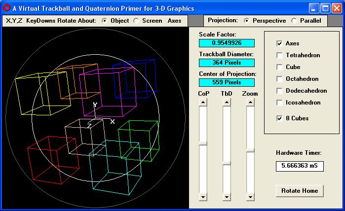



## A Virtual Trackball and Quaternion Primer

### Description

This program includes a virtual trackball and shows the programmer how to use quaternions to implement natural object rotation in 3-D graphics.
 
### More Info
 

             |
---                |---
**Submitted On**   |2011-08-16 00:24:10
**By**             |[RandyT\_CS](https://github.com/Planet-Source-Code/PSCIndex/blob/master/ByAuthor/randyt-cs.md)
**Level**          |Advanced
**User Rating**    |5.0 (15 globes from 3 users)
**Compatibility**  |VB 6\.0
**Category**       |[Graphics](https://github.com/Planet-Source-Code/PSCIndex/blob/master/ByCategory/graphics__1-46.md)
**World**          |[Visual Basic](https://github.com/Planet-Source-Code/PSCIndex/blob/master/ByWorld/visual-basic.md)
**Archive File**   |[A\_Virtual\_2209538162011\.zip](https://github.com/Planet-Source-Code/randyt-cs-a-virtual-trackball-and-quaternion-primer__1-74043/archive/master.zip)

